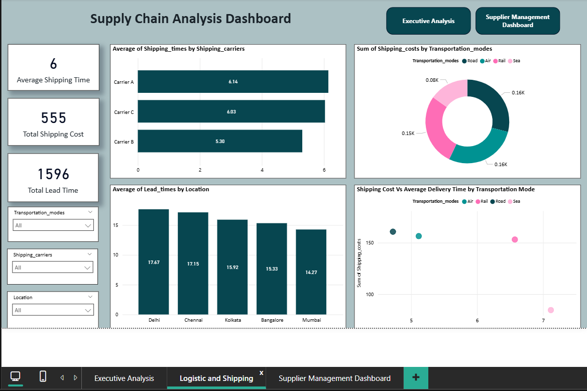
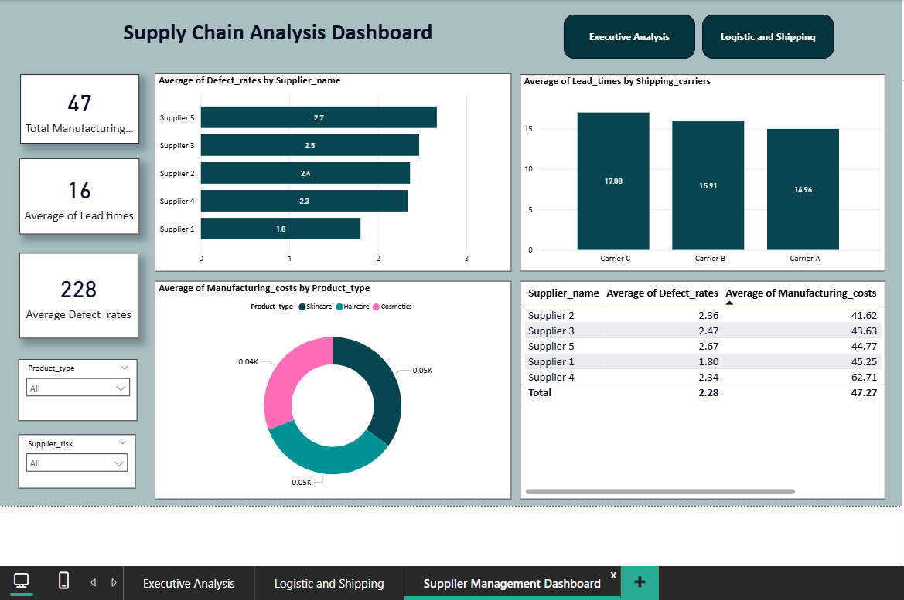

# 📦 Supply Chain Analysis 

## 👀 Dashboard Preview

## 🎯 Project Overview

This project is a complete Supply Chain Analysis built as a client project using Python, Power BI, and Excel. The objective is to analyze end‑to‑end supply chain performance and present insights through interactive dashboards and a comparison report across different product types.

The project demonstrates practical skills required for a Data Analyst role, including data extraction from a database, data cleaning, analysis, visualization, and business storytelling.

## 📌Project Objectives
*  Perform a diagnostic analysis of supply chain operations 

* Compare supply chain performance across different product types 

* Analyze revenue, costs, defects, lead times, logistics, and suppliers 

*  Build executive‑level dashboards for decision‑making 

*  Present insights in a clear, business‑friendly manner 

## Dataset Description

* The dataset contains detailed supply chain information, including:

* Product & Sales Data (Product type, SKU, Price, Revenue, Sales volume)

* Inventory & Production (Stock levels, Production volumes, Manufacturing costs)

* Logistics & Shipping (Shipping time, shipping cost, carriers, transportation modes)

* Supplier & Quality Metrics (Supplier name, defect rates, inspection results)

* Location‑based metrics (Supplier location, routes, lead times)

## 🛠 Tools & Technologies Used

1 .Microsoft Excel – Initial data understanding & validation 
2. Python (Basic) – Data cleaning, preprocessing, and exploratory analysis 
3. Power BI Desktop – Data modeling, DAX, and dashboard create 
4. chatgpt

## 📸 Dashboard Snapshot
### 🟦 **1. Executive Analysis (1-Page Overview)**
* This dashboard provides a high-level overview of overall supply chain performance for top management. 
* Helps management quickly understand which products and locations are performing well and where costs or risks are high. 
 

### 🟩 **2. Logistic & Shipping (2-Page Overview)**
* This dashboard analyzes logistics efficiency and shipping performance across different carriers and transportation modes. 
* Supports cost optimization and helps identify delays or inefficient shipping methods. 

### 🟧 **3. Supplier Management Dashboard (3-Page Overview)**
* This dashboard evaluates supplier performance and risk to improve sourcing decisions. 
* Helps identify high-risk suppliers, reduce defects, and choose reliable suppliers for long-term partnerships. 

## 📊 Insights

### 1️⃣ Executive Analysis Dashboard 

1.The business generated a total revenue of 578K, indicating strong overall sales performance.

2.The average profit per unit is 41, which shows healthy profitability per product.

3.A total of 46K units were sold, supported by 228 unique defect rates tracked across products.

4.Among all product types, Connectors contribute the highest share of revenue, followed by Sensors and Motors.

5.Sensors have the highest manufacturing cost, which may impact margins compared to other products.

6.Defect rates are higher in Motors, suggesting a need for quality improvement in that category.

### 2️⃣ Logistics & Shipping Dashboard 

1.The average shipping time is 6 days, indicating moderate delivery efficiency.

2.The company has handled 1,596 total lead times, reflecting high shipment volume.

3.Carrier A delivers faster on average compared to Carrier B and Carrier C.

4.Road transportation accounts for the highest shipping cost, followed by Rail and Air.

5.Among locations, Delhi and Mumbai show higher average lead times, indicating possible logistics bottlenecks.

6.Higher delivery time is generally associated with higher shipping costs, especially in Air transport.

### 3️⃣ Supplier Management Dashboard 

The organization works with 47 manufacturing units, showing a wide supplier base.

The average lead time across suppliers is 16 days, which impacts inventory planning.

The average defect rate is 228, highlighting quality concerns in supplier outputs.

Supplier 3 has the highest defect rate, while Supplier 1 performs better in quality.

Connectors have the highest manufacturing cost, followed by Sensors.

Suppliers with higher defect rates also show higher manufacturing costs, affecting profitability.

## 📌 Conclusion

This project showcases end‑to‑end data analytics skills, from raw database extraction to executive‑level insights. It reflects real‑world supply chain challenges and demonstrates the ability to support data‑driven decision making.

## 👩‍💻 Author

Ashwini Pawar 
Aspiring Data Analyst
  
