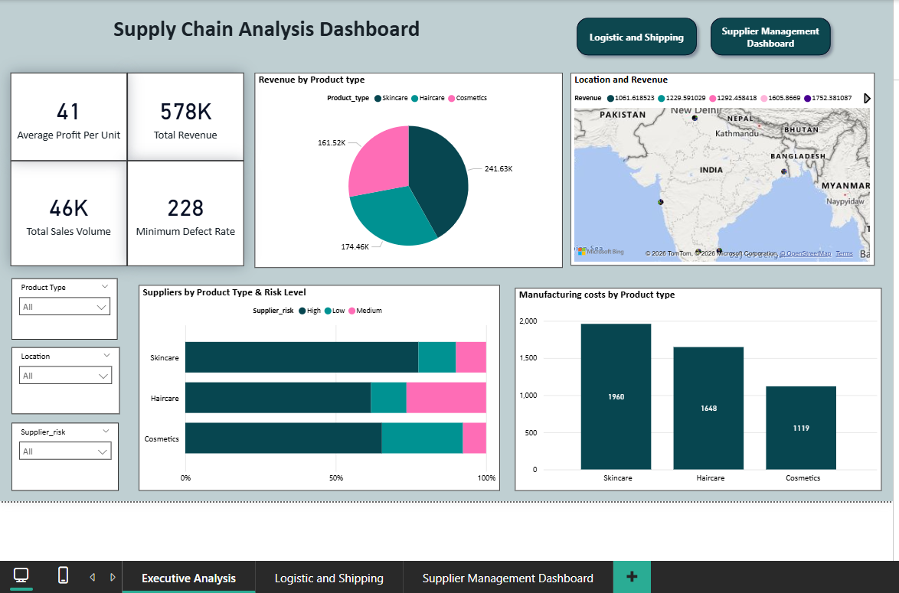

# 📦 Supply Chain Analysis 

## 👀 Dashboard Preview

## 🎯 Project Overview

This project is a complete Supply Chain Analysis built as a client project using Python, Power BI, and Excel. The objective is to analyze end‑to‑end supply chain performance and present insights through interactive dashboards and a comparison report across different product types.

The project demonstrates practical skills required for a Data Analyst role, including data extraction from a database, data cleaning, analysis, visualization, and business storytelling.

## 📌Project Objectives
*  Perform a diagnostic analysis of supply chain operations 

* Compare supply chain performance across different product types 

* Analyze revenue, costs, defects, lead times, logistics, and suppliers 

*  Build executive‑level dashboards for decision‑making 

*  Present insights in a clear, business‑friendly manner 

## Dataset Description

* The dataset contains detailed supply chain information, including:

* Product & Sales Data (Product type, SKU, Price, Revenue, Sales volume)

* Inventory & Production (Stock levels, Production volumes, Manufacturing costs)

* Logistics & Shipping (Shipping time, shipping cost, carriers, transportation modes)

* Supplier & Quality Metrics (Supplier name, defect rates, inspection results)

* Location‑based metrics (Supplier location, routes, lead times)

## 🛠 Tools & Technologies Used

1 .Microsoft Excel – Initial data understanding & validation 
2. Python (Basic) – Data cleaning, preprocessing, and exploratory analysis 
3. Power BI Desktop – Data modeling, DAX, and dashboard create 
4. chatgpt

## 📸 Dashboard Snapshot
### 🟦 **1. Main Dashboard (1-Page Overview)**
This page provides a complete one-page summary of the overall customer and sales performance.  
It includes key KPIs, demographic overview, spending trends, and category-wise analysis. 

### 🟩 **2. Customer Insights**
This page focuses on understanding customer demographics and behaviour patterns. 

### 🟧 **3. Payment Details**
This page shows payment preferences and transaction patterns. 

  
